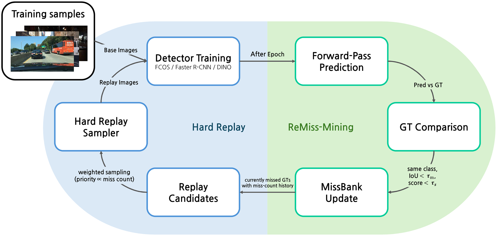
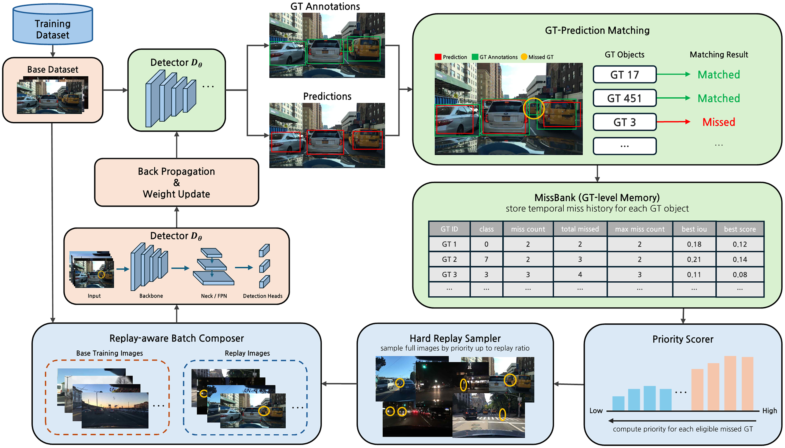
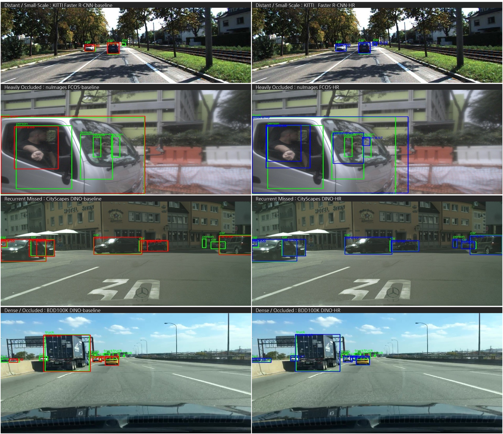

# ReMiss

This repository accompanies the paper **"ReMiss: Missed-Object History for Data Scheduling in Driving-Scene Object Detection"**, published in *Computers, Materials & Continua (CMC)*, 2026.

**Authors:** Seongwook Lee, Seungyeong Kim, Jaemin Oh, L. Minh Dang, Hyeonjoon Moon
**DOI:** [10.32604/cmc.2026.087886](https://doi.org/10.32604/cmc.2026.087886) · [Paper page](https://www.techscience.com/cmc/online/detail/28371)

## Overview

Average precision is an aggregate metric: it does not tell you *which* annotated objects a detector keeps missing during training. ReMiss turns that blind spot into a training signal. It tracks, for every ground-truth instance, whether it was missed after final post-processing — and how often — then re-schedules full images containing repeatedly missed objects into later epochs. The detector architecture and loss stay untouched; only the data schedule changes, so there is no extra cost at inference.

## Key Contributions

- **Missed-object history as a training signal.** Recurrent missed detection is formalized at the annotation-instance level: a ground-truth object counts as missed when no same-class final prediction matches it across repeated mining snapshots.
- **MissBank.** An instance-level memory that records each ground-truth object's miss status, miss-count history, and localization/confidence diagnostics during offline, no-gradient mining.
- **Hard Replay.** A data-layer sampler that scores full images containing currently missed objects by miss counts and matching gaps, and schedules them into the next epoch under a replay budget. Because replay is image-level, scale, occlusion, and scene context are preserved.
- **Detector-agnostic evaluation.** Evaluated on KITTI, BDD100K, Cityscapes, and nuImages with FCOS, Faster R-CNN, and DINO — 12 dataset–detector pairs in total.

## Results (from the paper)

- With the replay ratio fixed in advance at 5.0%, all 12 dataset–detector pairs improve by **+0.64–+2.17 AP** over the no-replay baseline.
- Selecting the replay setting by validation mAP50:95 gives **+1.03–+2.23 AP**.
- Across the full replay-ratio sweep, all 36 configurations improve (minimum +0.22 AP, sign test p < 10⁻¹⁰).
- No additional inference cost; training time increases by 13–27% over the training-only baseline.

## Figures from the Paper

**Figure 1 — Epoch-level ReMiss loop.** After training with base and replay images, no-gradient mining evaluates the base data, updates MissBank from final prediction–ground-truth matching, and selects replay candidates for the next epoch.



**Figure 2 — Detailed ReMiss architecture.** Training path, prediction–ground-truth matching, ground-truth-instance-level MissBank memory, priority scoring, and Hard Replay sampling. Missed-object history is passed to data-loader scheduling without changing the forward path or loss.



**Figure 6 — Qualitative comparison.** No-HR baseline (left) vs. validation-selected Hard Replay (right). Green boxes denote ground truth; red boxes are baseline predictions and blue boxes are Hard Replay predictions. Rows are organized by failure mode: distant/small-scale, heavily occluded, recurrently missed, and dense/occluded.



## Paper

```bibtex
@article{lee2026remiss,
  author  = {Seongwook Lee and Seungyeong Kim and Jaemin Oh and L. Minh Dang and Hyeonjoon Moon},
  title   = {ReMiss: Missed-Object History for Data Scheduling in Driving-Scene Object Detection},
  journal = {Computers, Materials \& Continua},
  year    = {2026},
  doi     = {10.32604/cmc.2026.087886},
  note    = {Published online 20 September 2026}
}
```

